# repo-pet

[](https://github.com/sascha910-RS/repo-pet/releases) [](LICENSE) · [English](README.en.md)

Eine GitHub Action, die aus Commit-Aktivität, CI-Status und Issue-Hygiene
deines Repos ein Pixel-Haustier rendert und das animierte SVG täglich in
einen eigenen Branch legt.

## Das Pet dieses Repos


Live erzeugt, täglich um 06:17 UTC.

## Die vier Zustände

| happy | content | sad | sick |
| :---: | :---: | :---: | :---: |
|  |  |  |  |

Die Breite zeigt die Sättigung, die Farbsättigung die Gesundheit. Die zwei
Balken darunter sind Sättigung und Gesundheit als Zahlenwert.

## Quick start

```yaml
name: repo-pet

on:
  schedule:
    - cron: "17 6 * * *"
  workflow_dispatch:

permissions:
  contents: write

jobs:
  pet:
    runs-on: ubuntu-latest
    steps:
      - uses: sascha910-RS/repo-pet@v1
        with:
          github_token: ${{ github.token }}
```

Danach einmal von Hand unter *Actions* starten, dann ins README:

```markdown

```

## Inputs

| Input | Default | Bedeutung |
| --- | --- | --- |
| `github_token` | — (Pflicht) | Üblich `${{ github.token }}`. Der Job braucht `contents: write`. |
| `output_branch` | `pet-output` | Branch für das SVG. Existiert er nicht, wird er als Orphan angelegt. |
| `output_filename` | `pet.svg` | Pfad im Branch. Unterordner sind erlaubt. |
| `repository` | aktuelles Repo | Gemessen wird dieses Repo, committet wird immer ins eigene. |
| `user` | — | Misst eine Person statt eines Repos: ihre Commit-Aktivität und den Zustand ihrer Repos. Hat Vorrang vor `repository`. |
| `dry_run` | `false` | Rendert und zeigt das Ergebnis in der Job Summary, schreibt nichts. |

## Outputs

| Output | Beispiel |
| --- | --- |
| `mood` | `content` |
| `satiety` | `64` |
| `health` | `52` |
| `svg_url` | `https://raw.githubusercontent.com/…/pet.svg` (leer bei `dry_run`) |

## Wie der Zustand berechnet wird

**Sättigung** kommt aus den Commits der letzten 7 Tage: 14 Commits sind voll.
Davon abgezogen werden 12 Punkte pro Tag ohne Commit, nach 2 Tagen Schonfrist
— ein Wochenende kostet also nichts.

**Gesundheit** startet bei 70. Grünes CI gibt +25, rotes −45, abgebrochenes
−10. Dazu das Verhältnis offener zu kürzlich geschlossenen Issues: bis +10,
bis −25.

**Stimmung** in fester Reihenfolge, Krankheit zuerst:

| | |
| --- | --- |
| `sick` | Gesundheit unter 40 |
| `happy` | Sättigung ≥ 70 **und** Gesundheit ≥ 70 |
| `sad` | Sättigung unter 35 |
| `content` | alles andere |

Fehlende Daten kosten nie Abzug. Ein Repo ohne CI ist nicht krank, nur
unbekannt. Ein leeres Repo landet auf `sad`, nicht auf `sick`.

Alle Schwellwerte stehen als benannte Konstanten oben in
[`src/state.ts`](src/state.ts).

## FAQ

**Warum ein eigener Branch?**
Das SVG ändert sich potenziell täglich. Im Default-Branch würde es die
Historie des Codes zumüllen.

**Wie schnell ist ein Update sichtbar?**
Nach spätestens fünf Minuten. `raw.githubusercontent.com` läuft nicht über
Camo, die übliche Badge-Cache-Problematik entfällt. Kein Cache-Buster nötig
— Details in [docs/caching.md](docs/caching.md).

**Es ist kein Commit entstanden.**
Dann hat sich nichts geändert. Die Action vergleicht den Git-Blob-Hash und
überspringt identische Inhalte; eine Historie aus gleichen Commits wäre nur
Rauschen.

**„Resource not accessible by integration"**
Dem Job fehlt `permissions: contents: write`. Steht das schon da, muss unter
*Settings → Actions → General* auch „Workflow permissions" auf „Read and
write" stehen.

**Kann ich ein fremdes Repo beobachten?**
Ja, über `repository`. Das SVG landet trotzdem in deinem Repo.

**Kann das Pet meine gesamte Aktivität zeigen statt eines Repos?**
Ja, über `user`. Sättigung kommt dann aus deinen Commits über alle Projekte,
Gesundheit aus dem Querschnitt: Anteil grüner CI-Läufe über deine zuletzt
bearbeiteten Repos, dazu offene gegen kürzlich geschlossene Issues. Ein
einzelnes rotes Nebenprojekt macht das Pet nicht krank — erst die Mehrheit.

**Zählen dabei auch meine privaten Repos?**
Mit `github.token` nicht, der sieht nur öffentliche Beiträge. Für private
brauchst du einen PAT mit `read:user` und die Profileinstellung „Include
private contributions on my profile".

**Warum ist die Animation reines CSS?**
`raw.githubusercontent.com` liefert SVGs mit
`default-src 'none'; …; sandbox`. JavaScript und SMIL sind dort tot,
`style-src 'unsafe-inline'` erlaubt den Style-Block ausdrücklich.

## Entwicklung

Siehe [CONTRIBUTING.md](CONTRIBUTING.md). Kurz: `npm run preview` schreibt
eine `preview.html` mit allen Stimmungen in drei Breiten auf hellem und
dunklem Grund.

## Lizenz

MIT, siehe [LICENSE](LICENSE).
